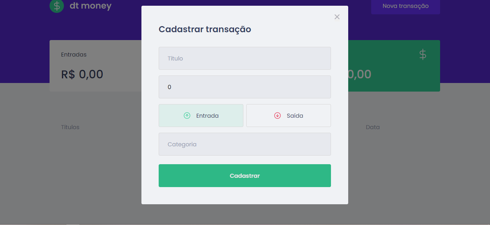

<h1 align="center">
Primeiro projeto do IgniteRocketseat
</h1>

## 💻 Sobre o projeto

O projeto surgiu com a missão de ajudar as pessoas organizarem transações de pagamentos e depósitos.


## 🖼 Screenshot da tela da aplicação

<br>

<br>

## 🛠 Tecnologias

As seguintes ferramentas foram usadas na construção do projeto:

### **Front-end**

<br>
- [x] React<br>
- [x] Typescript<br>
- [x] MirageJS<br>
- [x] Styled-Components<br>
- [x] Axios<br>
- [x] React Modal<br>
- [x] Javascript
<br>

## 👷 Como rodar

```bash
# Clonar o repositório
git clone https://github.com/MarcelFeo/Primeiro-Projeto-Ignite.git

# Entrar numa IDE de sua preferência 

# Executar o servidor ou usar um puglin que criar um servidor

```

Feito isso, abra o seu navegador e acesse `http://localhost:5500/`
ou em uma porta de sua preferência.
